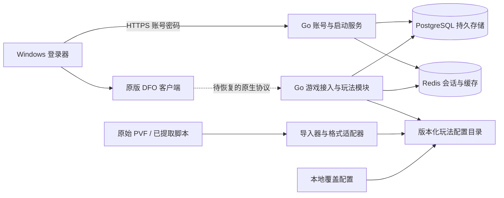

# 局域网多人架构与当前边界

状态：按当前需求实施，可继续调整。目标为一个局域网游戏服，支持多个独立账号；人数、连接池、监听地址和会话有效期由配置控制。2026-09-11 第一阶段已通过真实建角、持久保存和直接进入城镇验收；PVF 读取与 PostgreSQL 角色事务已验证。下图及 ADR 保留后续架构要求，不代表登录器、多人和全部玩法已经交付。具体范围见 [当前证据](current-evidence.md)。

## ADR-001：一个 Go 模块，少量进程，按领域分包

选择独立登录器、账号服务与游戏接入边界。账号、会话、持久层、缓存、配置导入、客户端启动分别拥有自己的包。后续角色、背包、场景、队伍、战斗作为游戏层内部领域包；有明确的独立扩容或故障隔离需求再拆进程。不为每个玩法启动一个微服务，避免维护复杂度。

## ADR-002：PostgreSQL 为持久数据唯一权威，Redis 保存可失效数据

账号唯一性、角色归属、道具与货币变更需要数据库约束和事务。PostgreSQL 与 MySQL 都适用；选择 PostgreSQL 的关系约束和 JSONB 扩展能力，避免同时引入两个业务数据库。SQLite 适合工具与小型单机，这里不作为多人服主库。

账号和密码摘要持久保存到 PostgreSQL；Redis 保存有 TTL 的登录会话、短期票据和限流计数。Redis 丢失后重新登录，不能丢失账号和角色存档。Redis 不可用时认证明确返回暂不可用，不伪造成功或静默改成无鉴权。

## ADR-003：玩法数值与代码机制分离

原始文件只读。导入器输出带来源、构建哈希、条目路径、内容哈希的版本化目录；覆盖配置单独保存。服务加载候选目录时检查格式、路径和摘要，再一次性替换内存快照；失败保留上一版。缺少真实配置时返回缺配置，不能自动生成固定装备、伤害或奖励。

配置不等于所有功能代码。PVF 中的数据和脚本需要对应解析器及执行机制；服务端事务、网络、战斗结算机制仍需 Go 实现。原始 PVF 的索引/加密未独立恢复前，不能把占位 JSON 称为官方配置导入完成。

## ADR-004：账号认证与原生游戏登录分开验收

登录器账号密码只交给自建 HTTPS 服务，密码使用 Argon2id 摘要并带随机盐。TLS 信任材料由服主分发，不能默认跳过证书校验。客户端命令行不携带密码。

原生客户端已通过本地测试密钥、预检查、登录、建角和直接进入城镇。现有 probe 仍是回环开发接入端；独立账号绑定、密码认证、完整角色状态、教程和多人世界仍需实现和验证。单个测试账号进城不等于正式多人账号服务完成。

## 非功能要求和失败行为

- 所有监听与人数上限、超时、密码参数、缓存前缀、连接池、资源路径来自配置。
- 独立数据目录和端口；不覆盖其他项目的账号、缓存和运行服务。
- 注册重名依靠数据库唯一约束；并发请求应只有一次成功。
- 认证并发受限，防止大量密码哈希耗尽内存。
- 账号 API 与数据库使用有限超时；日志不记录密码、明文会话或数据库密钥。
- 完整多人验收仍需要至少两个真实客户端登录、建角、互见、移动及退出重进存档。

技术依据：[PostgreSQL 约束](https://www.postgresql.org/docs/current/ddl-constraints.html)、[pgxpool](https://pkg.go.dev/github.com/jackc/pgx/v5/pgxpool)、[Redis Go 客户端](https://redis.io/docs/latest/develop/clients/go/)、[Argon2](https://pkg.go.dev/golang.org/x/crypto/argon2)。
