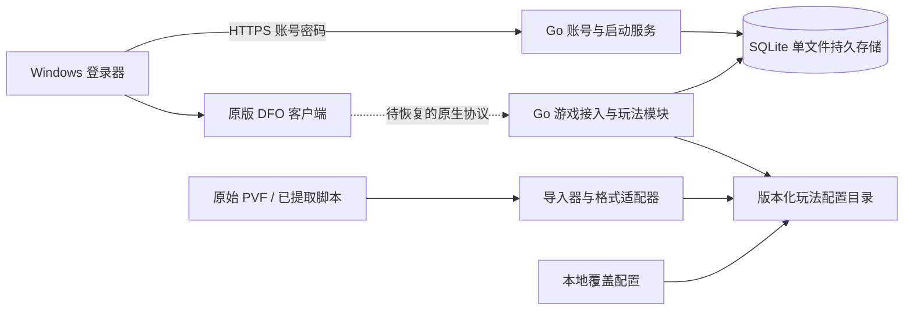

# 局域网多人架构与当前边界

状态：按当前需求实施，可继续调整。目标为一个局域网游戏服，支持多个独立账号；人数、连接池、监听地址和会话有效期由配置控制。2026-09-11 第一阶段已通过真实建角、持久保存和直接进入城镇验收；PVF 读取与 PostgreSQL 角色事务已验证。下图及 ADR 保留后续架构要求，不代表登录器、多人和全部玩法已经交付。具体范围见 [当前证据](current-evidence.md)。

## ADR-001：一个 Go 模块，少量进程，按领域分包

选择独立登录器、账号服务与游戏接入边界。账号、会话、持久层、配置导入、客户端启动分别拥有自己的包。后续角色、背包、场景、队伍、战斗作为游戏层内部领域包；有明确的独立扩容或故障隔离需求再拆进程。不为每个玩法启动一个微服务，避免维护复杂度。

## ADR-002：持久数据唯一权威（原 PostgreSQL → 2026-10-05 起 SQLite）

> ⚠️ **2026-10-05 最终口径**：PostgreSQL 支持已**整体移除**，**SQLite 单文件**是唯一引擎与唯一权威存储
> （见根 `AGENTS.md` §0.6）。下文 2026-10-04 的「双引擎」登记是中间态，已被此次移除取代；
> PostgreSQL/pgx/pgdata 相关的实现与配置均已从代码中删除，`pgdata` 只作只读留档。
>
> ⚠️ **2026-10-04 业主改口（登记，待实施）**：业主明确要求 **PostgreSQL + SQLite 双引擎**。
> 本节末句"SQLite 适合工具与小型单机，这里不作为多人服主库"与
> `docs/database-sqlc-migration.md（2026-10-05 已删除）` 的"不提前引入双引擎接口"**均被推翻**，
> 实施计划见 [database-dual-engine-plan.md](database-dual-engine-plan.md)（S1 抽接口缝 → S5 分叉控制）。
> 定性保留：**默认引擎仍是 PostgreSQL**；SQLite 用于单机/工具，不做多人服主库（单写者）。
> 新会话在开工 S1 时须一并修订本节与 sqlc 文档，避免代码与文档互相矛盾。

装备操作共享 `internal/inventory/event_receipt.go` 的提交与持久收据解码流程，仍由 storage 原有事务管理归属、锁和幂等；金币强化的账号材料事务独立保留。网关的 `inventory_row.go` 统一增量行和穿戴刷新，各命令自行决定回执顺序；增幅书继续保留原有穿戴刷新容错。`packet_plan.go` 逐包发送，失败时立即停止，仅在成功发送后记录该包，不替换需要整组预编码的发送路径。

增幅书、增幅券、材料增幅及锻造共用 `equipment_lookup.go` 的容器定位，返回实际容器、装备切片和索引；各业务继续负责验证、修改及写回。增幅书先查背包，其他三条先查请求容器；继承的 Group 过滤和普通强化的严格容器限制独立保留。`equipmentSession.requestKey` 统一会话 nonce 与原始帧哈希，各调用方保留原操作前缀及事件键格式。

账号唯一性、角色归属、道具与货币变更需要数据库约束和事务。PostgreSQL 与 MySQL 都适用；选择 PostgreSQL 的关系约束和 JSONB 扩展能力，避免同时引入两个业务数据库。SQLite 适合工具与小型单机，这里不作为多人服主库。

账号和密码摘要持久保存到 PostgreSQL；角色与物品读取以 PostgreSQL 为准。连接生命周期和限流沿用 Go 服务端现有实现；独立账号登录器仍按 ADR-004 单独实现与验收，不新增存储服务依赖。

## ADR-003：玩法数值与代码机制分离

PVF 是游戏内容真源，对于 Go 服务端是只读资源。服务端负责读取、解析与校验，运行及加载过程不得反写 PVF。物品、任务、技能、副本、奖励及 PVF 已提供的数值由服务端之外的内容编辑工具维护，编辑完成后发布资源供客户端和服务端读取。Go 解析器产生带来源哈希、条目路径和内容哈希的内存规则，业务模块消费这些规则。导出 JSON 与派生缓存是可重建产物，不作为第二份需人工维护的玩法数据。

2026-10-01 用户明确要求单一内容真源，后续不再建立玩法差异 JSON。已有手工概率、白名单及默认值按调用路径逐项核查：能由 PVF 确定的解除覆盖与重复清单；未定位源字段或客户端机制的先记录证据缺口。此前明确指定的调服数值应核对 PVF 是否支持表达；不能仅因迁移就擅自取消已确认行为或猜测一个 PVF 字段。端口、数据库连接、日志等运维参数独立配置。

服务加载候选资源时检查格式、引用与摘要，再发布内存快照。缺少真实配置时返回明确错误，不能自动生成固定装备、伤害或奖励。PVF 内容版本更新与玩家存档兼容分别验证，不能以 checksum 别名或直接改写存档 source 绕过版本差异。本次仅建立审计与目标边界，运行迁移进度见根目录 docs/todo/pvf/PVF单一内容真源改造计划.md。

配置不等于所有功能代码。PVF 中的数据和脚本需要对应解析器及执行机制；服务端事务、网络、战斗结算机制仍需 Go 实现。原始 PVF 的索引/加密未独立恢复前，不能把占位 JSON 称为官方配置导入完成。

## ADR-004：账号认证与原生游戏登录分开验收

登录器账号密码只交给自建 HTTPS 服务，密码使用 Argon2id 摘要并带随机盐。TLS 信任材料由服主分发，不能默认跳过证书校验。客户端命令行不携带密码。

原生客户端已通过本地测试密钥、预检查、登录、建角和直接进入城镇。现有 probe 仍是回环开发接入端；独立账号绑定、密码认证、完整角色状态、教程和多人世界仍需实现和验证。单个测试账号进城不等于正式多人账号服务完成。

## 非功能要求和失败行为

- 所有监听与人数上限、超时、密码参数、连接池、资源路径来自配置。
- 独立数据目录和端口；不覆盖其他项目的账号和运行服务。
- 注册重名依靠数据库唯一约束；并发请求应只有一次成功。
- 认证并发受限，防止大量密码哈希耗尽内存。
- 账号 API 与数据库使用有限超时；日志不记录密码、明文会话或数据库密钥。
- 完整多人验收仍需要至少两个真实客户端登录、建角、互见、移动及退出重进存档。

技术依据：[PostgreSQL 约束](https://www.postgresql.org/docs/current/ddl-constraints.html)、[pgxpool](https://pkg.go.dev/github.com/jackc/pgx/v5/pgxpool)、[Argon2](https://pkg.go.dev/golang.org/x/crypto/argon2)。
